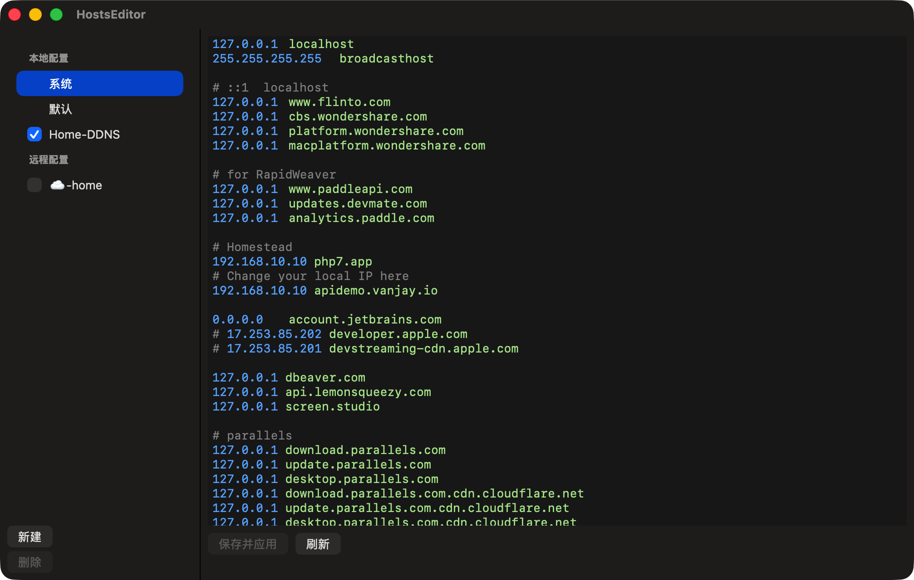

# HostsEditor

一个 macOS 下的 Hosts 文件编辑与方案切换工具，使用 Swift + AppKit 开发，当前工程配置最低支持 macOS 13.0。

它解决的不是“编辑一个文本文件”，而是“在多套 hosts 配置之间稳定切换，并且能安全写回 `/etc/hosts`”。

## 界面预览



## Star 趋势

[](https://star-history.com/#wangwanjie/HostsEditor&Date)

## 特性

- 多方案管理：支持创建多套本地 hosts 方案，按需启用或停用
- 系统级应用：将启用中的方案组合后写入系统 `/etc/hosts`
- 远程方案：可从 URL 拉取 hosts 内容保存为方案，并手动刷新
- 菜单栏快速切换：通过状态栏图标快速启用或关闭方案
- 语法高亮：对注释、IP、主机名进行高亮，支持浅色和深色外观
- 原始内容保留：会保留系统 hosts 中不属于 HostsEditor 管理块的基础内容
- 自动更新：集成 Sparkle，可通过 appcast 分发新版本

## 适用场景

- 本地开发时频繁切换测试环境 / 预发环境 / 线上环境
- 需要保存多套常用 hosts 配置，而不是反复手动注释
- 团队内部通过 URL 分发一份共享 hosts 配置
- 希望从菜单栏快速开关某个 hosts 方案

## 工作方式

HostsEditor 不会粗暴覆盖整个 `/etc/hosts`。

它会把由应用管理的内容写成带标记的块：

```text
# HostsEditor:BEGIN:<profile-id>
...
# HostsEditor:END:<profile-id>
```

这样做有两个目的：

- 可以把多个启用方案组合写入系统 hosts
- 可以保留不属于 HostsEditor 管理的原始基础内容

界面中的几个关键项含义如下：

- `系统`：当前系统 `/etc/hosts` 的完整内容，可直接编辑并保存
- `默认`：从系统 hosts 中剥离掉 HostsEditor 管理块后的基础内容，只读查看
- `本地配置`：你手动维护的方案，可编辑、启用、删除
- `远程配置`：从 URL 拉取的方案，支持刷新

## 首次使用

1. 用 Xcode 运行应用，或分发构建后的 `.app`
2. 首次读取或写入系统 hosts 时，应用会尝试注册特权 Helper
3. 如果系统要求授权，请输入管理员密码
4. 在较新的 macOS 上，如果出现“需要允许后台程序”，前往：
   `系统设置 -> 通用 -> 登录项与扩展程序`
   允许 HostsEditor 的后台程序后重新打开应用

## 权限与安全说明

编辑 `/etc/hosts` 需要管理员权限。HostsEditor 通过一个特权 Helper 完成实际读写：

- 主应用负责界面、方案管理、状态栏和远程拉取
- Helper 通过 `SMAppService` 注册为后台守护进程
- 主应用通过 XPC 与 Helper 通信
- 真正写入 `/etc/hosts` 的动作由 Helper 以高权限执行

这意味着：

- 主应用本身不直接以 root 运行
- 首次安装或重新注册 Helper 时需要系统授权
- 主应用需要关闭 App Sandbox，才能安装并连接 Helper

## 构建与运行

### 环境要求

- 较新版本的 Xcode
- macOS 13.0 及以上
- 可用的代码签名 Team

### 本地运行

1. 打开 `HostsEditor.xcodeproj`
2. 选择 Scheme：`HostsEditor`
3. Destination 选择 `My Mac`
4. 在 `Signing & Capabilities` 中确认：
   - `HostsEditor` 与 `HostsEditorHelper` 的 Team 一致
   - 使用有效签名，或选择 `Sign to Run Locally`
5. 运行应用

说明：

- 项目中的 Helper plist 已使用 `$(DEVELOPMENT_TEAM)`，构建时会自动替换为当前 Team
- 首次真正执行读写系统 hosts 时，系统可能再次弹出权限或后台程序授权提示

## 使用说明

### 新建本地方案

1. 点击左下角 `新建`
2. 选择 `本地方案`
3. 编辑 hosts 内容
4. 点击 `保存并应用`

如果该方案已勾选启用，保存后会立即重新写入系统 hosts。

### 添加远程方案

1. 点击 `新建`
2. 选择 `远程方案`
3. 输入可访问的 URL
4. 应用会拉取内容并创建一个远程方案

远程方案支持手动 `刷新远程`，刷新后如果该方案当前处于启用状态，会自动重新写入系统 hosts。

### 从菜单栏快速切换

应用启动后会在菜单栏显示图标。点击图标即可：

- 打开主窗口
- 查看所有方案
- 快速切换某个方案的启用状态
- 退出应用

## 常见问题

### 出现 “couldn’t communicate with a helper application”

通常是因为系统里残留了旧版本后台任务记录，或者之前用不同 Team 构建过该应用，导致签名不一致。

先退出 HostsEditor，然后清理旧记录：

```bash
sudo launchctl bootout system/cn.vanjay.HostsEditor.Helper 2>/dev/null || true
sudo launchctl bootout system/cn.vanjay.HostsEditorHelper 2>/dev/null || true
sfltool dumpbtm | rg 'HostsEditor|cn\\.vanjay'
```

然后执行：

1. 在 Xcode 中 `Clean Build Folder`
2. 确认 `/Applications`、`~/Applications` 里没有旧的 `HostsEditor.app`
3. 重新运行当前构建
4. 在应用里点击一次“启用或修复后台帮助程序”
5. 再次触发一次系统 hosts 的读取或写入

### 提示“需要允许后台程序”

前往：

`系统设置 -> 通用 -> 登录项与扩展程序`

允许 HostsEditor 的后台程序后，重新启动应用。

## 打包发布

仓库内提供了 DMG 打包脚本：

```bash
./scripts/build_dmg.sh --no-notarize
```

默认行为：

- 使用 `Release` 配置构建
- 生成通用二进制（`arm64` + `x86_64`）
- 输出到 `build/dmg/`
- 文件名格式为 `HostsEditor_V_<版本号>.dmg`

如果你已经配置好 notarization 的 keychain profile，也可以直接执行：

```bash
./scripts/build_dmg.sh --keychain-profile <your-profile>
```

如需把生成好的 DMG 上传到 GitHub Releases，可执行：

```bash
./scripts/publish_github_release.sh
```

说明：

- 默认上传 `build/dmg/` 下最新的 `HostsEditor_V_*.dmg`
- 默认优先从 `origin_github` remote 推断 GitHub 仓库，也可通过 `--repo OWNER/REPO` 显式指定
- 默认使用 `v<版本号>` 作为 tag，使用 `HostsEditor v<版本号>` 作为 release 标题
- 如果对应 tag 的 release 已存在，会覆盖上传同名 DMG 资源
- 依赖 `gh` CLI，使用前需要先执行 `gh auth login`

示例：

```bash
./scripts/publish_github_release.sh --generate-notes
./scripts/publish_github_release.sh --repo wangwanjie/HostsEditor --tag v1.0
```

## 项目结构

```text
HostsEditor/
├── HostsEditor/                  # 主应用
│   ├── Models/                   # 数据模型
│   ├── Services/                 # 方案管理、系统 hosts 组合/写入、远程拉取
│   ├── Views/                    # 编辑器、列表、语法高亮等 UI
│   └── PrivilegedHelper/         # Helper 安装与 XPC 通信
├── HostsEditorHelper/            # 特权 Helper，可读写 /etc/hosts
├── HostsEditorTests/             # 单元测试目标
├── HostsEditorUITests/           # UI 测试目标
├── scripts/build_dmg.sh          # DMG 打包脚本
└── scripts/publish_github_release.sh # GitHub Releases 上传脚本
```

## 自动更新

项目已接入 Sparkle，并使用以下配置：

- appcast 地址：`https://raw.githubusercontent.com/wangwanjie/HostsEditor/main/appcast.xml`
- Sparkle EdDSA Keychain account：`cn.vanjay.HostsEditor.sparkle`
- `SUPublicEDKey` 已写入 `HostsEditor/Info.plist`

首次在发布机器上配置 Sparkle 私钥：

```bash
<Sparkle bin>/generate_keys --account cn.vanjay.HostsEditor.sparkle
```

`Sparkle bin` 通常位于：

```bash
~/Library/Developer/Xcode/DerivedData/<DerivedData>/SourcePackages/artifacts/sparkle/Sparkle/bin
```

发布 GitHub Release 后，脚本会自动：

1. 上传当前 DMG 到 GitHub Releases
2. 把该 DMG 复制到本地 `build/appcast-archives/`
3. 重新生成仓库根目录下的 `appcast.xml`

命令：

```bash
./scripts/publish_github_release.sh --repo wangwanjie/HostsEditor
```

脚本执行完后，还需要把更新后的 `appcast.xml` 提交并推送到 GitHub 默认分支。

如果要在 appcast 中保留多个历史版本，不要清空本地 `build/appcast-archives/` 目录；脚本会把每次发布过的 DMG 累积到这里，再据此生成多版本更新清单。

## 技术栈

- Swift
- AppKit
- Foundation
- Combine
- ServiceManagement
- Security
- XPC
- Sparkle
